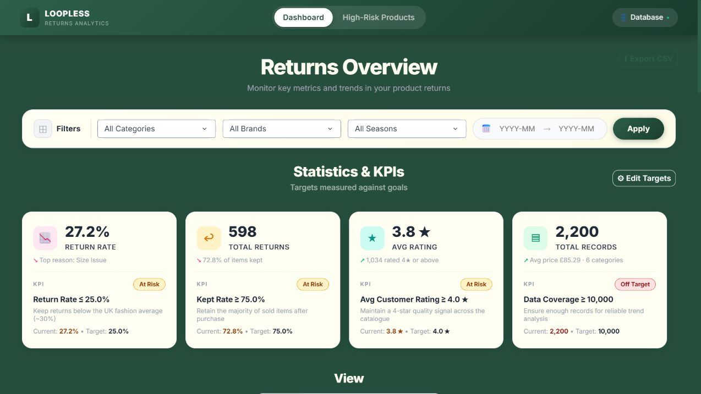
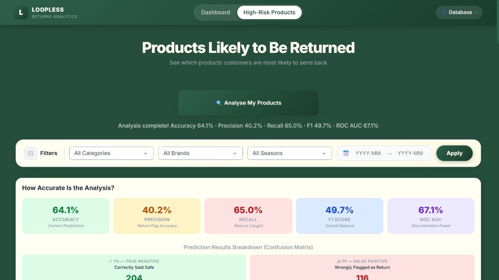
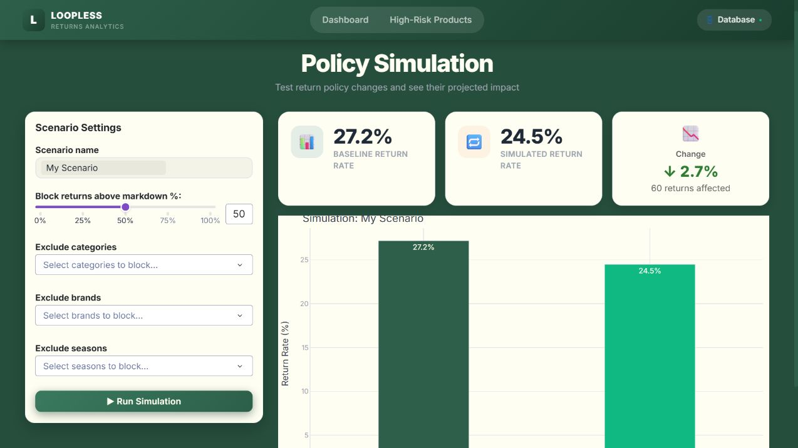
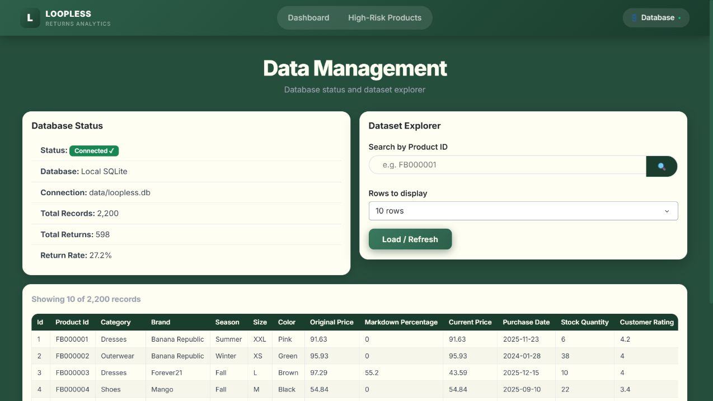
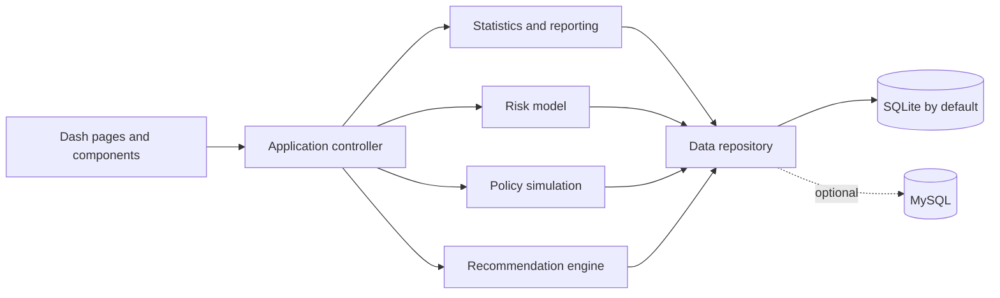

# Loopless — Returns Intelligence Dashboard

[](https://github.com/abambie/loopless-returns-analyser/actions/workflows/ci.yml)
[](https://www.python.org/)
[](LICENSE)

Loopless is a self-contained retail analytics application that turns purchase and returns data into operational insight. It combines interactive dashboards, return-risk modelling, customer/product segmentation, and policy simulation in a five-page Dash interface.

This was developed from my final-year Business Information Systems project and rebuilt as a reproducible portfolio project: it now runs locally with SQLite, contains no embedded credentials, includes automated tests, and documents its model results.



## What the project demonstrates

- **Data analysis:** KPIs, return reasons, trends, filters, and CSV export across 2,200 purchase records.
- **Machine learning:** a balanced logistic-regression classifier for return-risk scoring, benchmarked against random forest on the same held-out test set.
- **Segmentation:** K-means clustering to identify product groups with different price, markdown, rating, and return profiles.
- **Decision support:** a what-if simulator estimating how proposed return-policy restrictions would affect the observed return rate.
- **Application development:** a multi-page Dash interface with reusable components, service/repository separation, persistent model artefacts, and graceful optional AI integration.
- **Responsible engineering:** environment-based secrets, a local-first database, reproducible dependencies, unit tests, and continuous integration.

## Product tour

| Route | Capability |
| --- | --- |
| `/` | Return KPIs, targets, trend charts, filters, and CSV export |
| `/risk` | Train/evaluate the classifier and rank high-risk products |
| `/simulation` | Test markdown, category, brand, and season restrictions |
| `/recommendations` | Generate rule-based operational recommendations |
| `/data` | Check database health and search the underlying dataset |

<details>
<summary>More screenshots</summary>

### Return-risk analysis



### Policy simulation



### Dataset explorer



</details>

## Model evaluation

The benchmark uses a stratified 80/20 train/test split with `random_state=42`. Categorical features are one-hot encoded, while numeric features are standardised in the reproducible comparison script.

| Model | Accuracy | Precision | Recall | F1 | ROC AUC |
| --- | ---: | ---: | ---: | ---: | ---: |
| Logistic regression | 63.9% | 40.0% | **65.0%** | **49.5%** | **67.1%** |
| Random forest | **66.8%** | 38.6% | 36.7% | 37.6% | 63.2% |

Logistic regression remains the application model because it identifies more observed returns (65.0% recall), has the stronger F1 and ROC AUC scores, and is easier to explain. The comparison is deliberately reported rather than selecting a model on accuracy alone.

The K-means experiment produced four exploratory segments (`silhouette score = 0.219`). The highest-return segment had a 35.9% return rate and the largest average markdown, suggesting a useful hypothesis for further analysis rather than proof of causation.

Reproduce the results with:

```bash
python analysis/model_comparison.py
```

The generated metrics are saved to [`docs/model_results.json`](docs/model_results.json).

## Quick start

### 1. Clone and create an environment

```bash
git clone https://github.com/abambie/loopless-returns-analyser.git
cd loopless-returns-analyser
python -m venv .venv
```

Activate it on Windows PowerShell:

```powershell
.venv\Scripts\Activate.ps1
```

Or on macOS/Linux:

```bash
source .venv/bin/activate
```

### 2. Install and run

```bash
pip install -r requirements.txt
python app.py
```

Open [http://127.0.0.1:8050](http://127.0.0.1:8050). On first launch, Loopless creates `data/loopless.db` and imports the bundled CSV automatically. No database account, API key, or internet connection is required for the core application.

## Tests

Install the development dependencies and run the suite:

```bash
pip install -r requirements-dev.txt
pytest -q
```

The tests cover local database initialisation/filtering, feature engineering and model scoring, and policy-simulation calculations. GitHub Actions runs the tests and model comparison on every push and pull request.

## Architecture



```text
app.py                 Application entry point and routing
bootstrap.py           Database initialisation and service wiring
config.py              Paths, styling, and environment-based configuration
core/                  Repository, domain, analytics, ML, and simulation logic
pages/                 Five Dash page modules and their callbacks
components/            Reusable navigation, filter, card, chart, and KPI elements
assets/                Dash-loaded CSS, JavaScript, and favicon
analysis/              Reproducible model comparison and clustering experiment
tests/                 Automated tests
data/                  Bundled academic fashion-retail dataset
docs/                  Screenshots and generated evaluation results
```

## Configuration

### Optional AI recommendations

All analytics work without an API key. To enable tailored per-product recommendations, set `ANTHROPIC_API_KEY` in your environment before starting the app. The key is never stored in source control; missing or invalid keys produce a safe fallback message.

### Optional MySQL backend

SQLite is the default and recommended way to review the project. MySQL remains available for deployment scenarios:

```bash
pip install mysql-connector-python
```

Copy `.env.example` as a reference and provide `LOOPLESS_MYSQL_HOST`, `LOOPLESS_MYSQL_USER`, `LOOPLESS_MYSQL_PASSWORD`, and `LOOPLESS_MYSQL_DATABASE` through your environment. Do not commit real credentials.

### Replacing the data

Use a CSV with the same schema, update `CSV_PATH` in `config.py` if its filename differs, then run:

```bash
python reset_db.py
python app.py
```

The reset utility recreates the local database and removes trained model artefacts so that the next risk analysis starts cleanly.

## Data and limitations

- The repository contains an academic fashion-retail dataset with 2,200 records and no personal customer information.
- The model is a portfolio prototype trained on the bundled data; its scores should not be treated as production decisions without fresh validation, monitoring, and bias/error analysis.
- The simulator applies transparent assumptions to historical records. Its output is a scenario estimate, not a causal forecast.
- The clustering is exploratory and the modest silhouette score means the segments should be tested against additional data before business use.

## Author

**Aziz Sow Bambie** — First-Class BSc Business Information Systems graduate interested in data analysis, technology consulting, and responsible AI.

## License

Released under the [MIT License](LICENSE).
